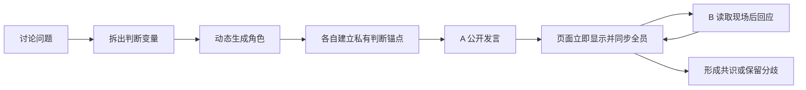

# 共识现场：多 Agent 实时共享圆桌

让多个拥有独立上下文的 Agent 进入同一个共享会场，逐条公开发言、互相质疑、修正立场并形成可追溯的共识。

[查看公开演示](https://traochtapp.github.io/pp/) · [查看 Skill](./skills/run-deliberation-council/SKILL.md)

## 它和传统多 Agent 有什么不同

传统做法通常是：多个 Agent 各自回答，最后由一个 Agent 汇总。这里采用的是“独立大脑，共享会场”模式：

1. 先把问题拆成缺失的判断变量，再动态选择真正合适的理论人物或职能专家。
2. 每位专家在独立私有上下文中建立自己的判断锚点，避免多人共用一个答案。
3. 每条公开发言先立即显示，再原样广播给所有其他 Agent。
4. 下一位必须读完同一份公共记录，点名回应、质疑、补充或公开修正。
5. 主持人按“定义 → 初始立场 → 交叉质询 → 核心矛盾 → 立场更新 → 共识校准”推进讨论。
6. 用户可以实时旁观，也可以随时插话、暂停或要求换方向。



## Skill 能做什么

- 根据议题变化自动选角，不固定为招聘、培训或绩效等少数角色。
- 让每个 Agent 保持独立理论、证据边界和初始判断。
- 维护唯一、按顺序追加的公共讨论记录。
- 要求角色真正回应前文，而不是平行输出几份答案。
- 将每条自然语言发言逐条发布到本地右侧聊天室。
- 把用户插话原样写入记录，并同步给所有在场 Agent。
- 在结尾输出共识、仍未解决的分歧、证据缺口和下一步动作。

## 安装

使用 skills CLI：

```bash
bunx skills add traochtapp/pp -g -a codex --skill run-deliberation-council -y
```

或者手动安装：

```bash
git clone https://github.com/traochtapp/pp.git
mkdir -p ~/.codex/skills
cp -R pp/skills/run-deliberation-council ~/.codex/skills/
```

## 使用示例

```text
开一个多 Agent 实时讨论室，讨论怎么才能保留员工。
```

```text
围绕“如何做市场调研”动态选择三位真正有互补判断力的专家，
让他们在共享聊天室中逐条交锋，我要实时看到过程。
```

讨论进行中还可以直接插话：

```text
主持人，可以换个方向吗？请从管理者可信度而不是福利方案继续讨论。
```

## 本地实时聊天室

右侧聊天室由 Skill 自带的本地 Node.js 服务提供：

```bash
node ~/.codex/skills/run-deliberation-council/scripts/live-room-server.mjs --port 4321
```

然后打开 `http://127.0.0.1:4321/`。每生成一条公共发言，页面就立即出现一条，不需要等整场讨论结束。

展示层只绑定本机 `127.0.0.1`，不调用外部模型 API；专家发言本身仍会使用 Codex 正常的模型额度。真实共享讨论必须按发言顺序进行，因此比“并行回答后统一总结”更慢，但过程可见、可插话、可追溯。

## 仓库结构

```text
skills/run-deliberation-council/
├── SKILL.md
├── agents/openai.yaml
├── assets/live-room.html
├── scripts/live-room-server.mjs
└── references/
    ├── role-construction.md
    ├── discussion-structure.md
    ├── protocol.md
    ├── prompt-templates.md
    └── live-room-surface.md
```
